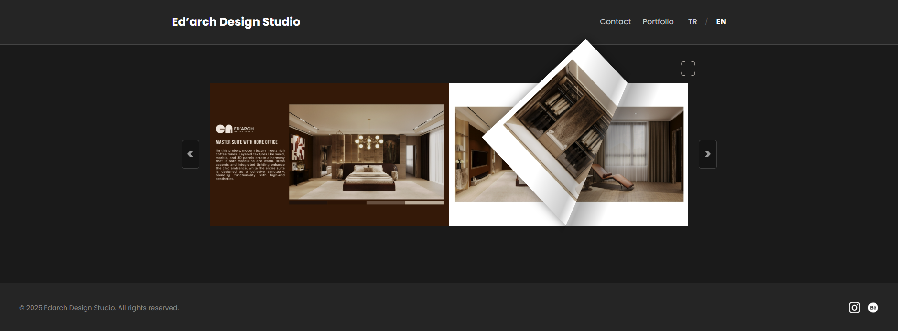
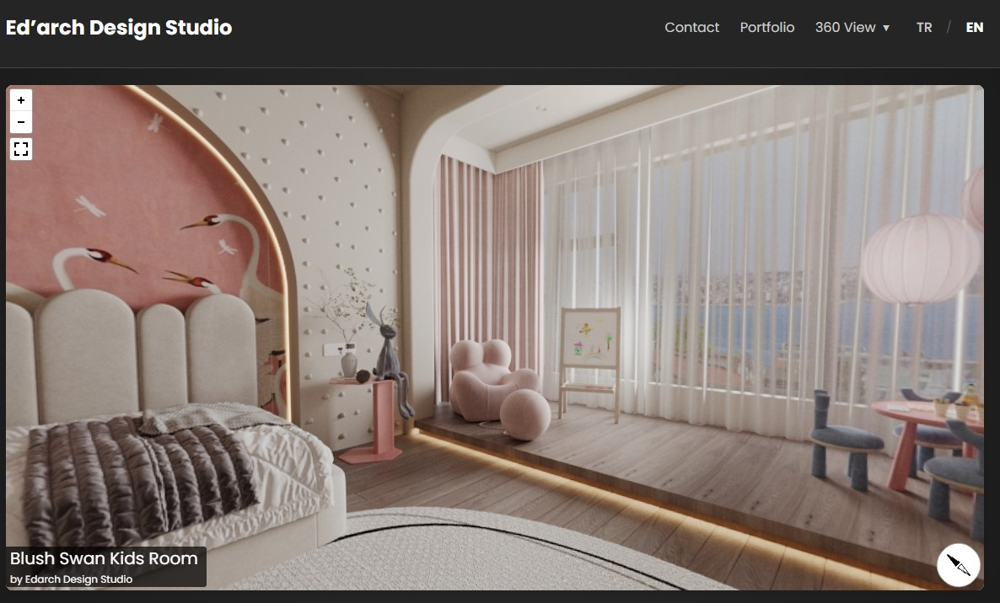
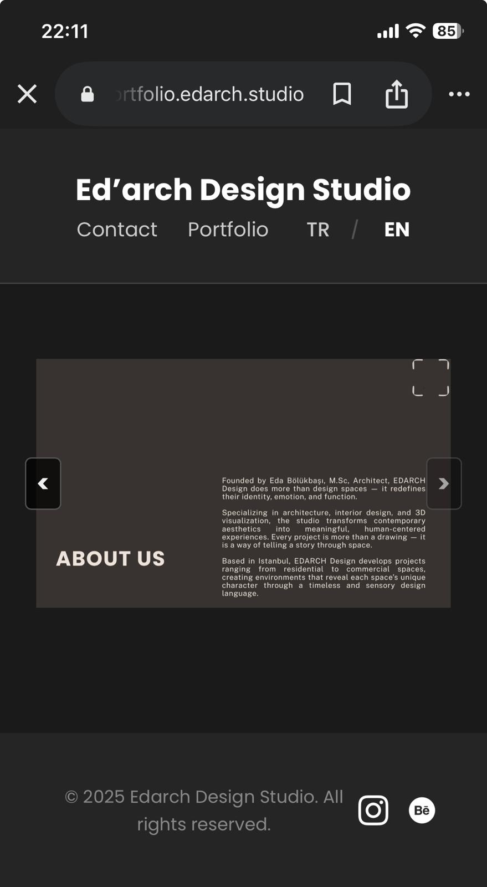
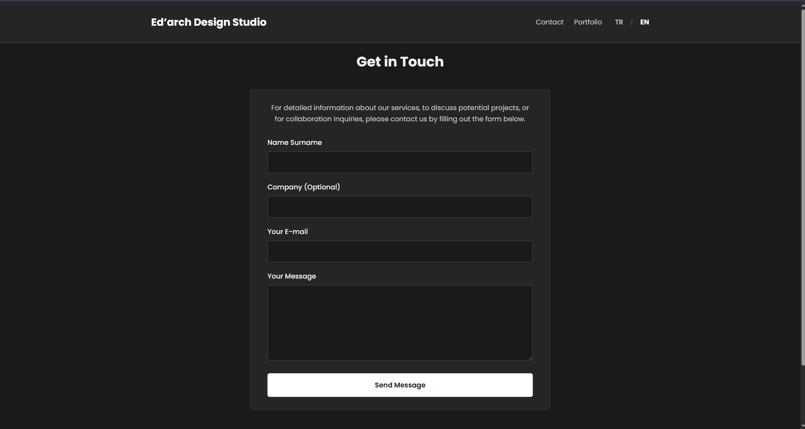

   
  <h1 style="font-family: 'Helvetica Neue', Helvetica, sans-serif; letter-spacing: 3px; text-transform: uppercase; color: #000;">
    EDARCH DESIGN STUDIO
  </h1>
  

    Interactive Digital Catalog & Portfolio
  

  

 
 

<h3>🎯 The Engineering Challenge: Why Build Custom?</h3>

  As a developer, I had to choose between using existing tools or engineering a custom solution. I conducted a requirements analysis and identified two major bottlenecks in the market:

<table width="100%">
  <tr>
    <th width="45%" align="left">❌ The Problem (Existing Tools)</th>
    <th width="10%" align="center">vs</th>
    <th width="45%" align="left">✅ My Custom Solution</th>
  </tr>
  <tr>
    <td valign="top">
      <strong>1. Platform Limitations:</strong>  
      Canva's built-in flipbook features are basic, lack responsiveness, and don't allow for deep UI customization (e.g., custom zoom, dark mode).
    </td>
    <td align="center">➤</td>
    <td valign="top">
      <strong>Full Control:</strong> 
      Built with <strong>HTML/CSS/JS</strong>, allowing for a fully custom UI, integrated contact forms, and a specific "Dark Mode" aesthetic.
    </td>
  </tr>
  <tr>
    <td valign="top">
      <strong>2. Recurring Costs:</strong>  
      Services like Issuu or Flipsnack charge <strong>monthly subscriptions</strong> to remove ads or enable embedding.
    </td>
    <td align="center">➤</td>
    <td valign="top">
      <strong>Lifetime Free Ownership:</strong> 
      By coding it manually, I provided the client with a <strong>cost-free, unlimited</strong> asset that they own 100% forever, with zero recurring fees.
    </td>
  </tr>
</table>

 
 

<h3>📸 Experience Gallery</h3>

<table width="100%" style="border-collapse: collapse;">
  
  <tr>
    <td colspan="2" align="center" style="padding-bottom: 40px;">
      <h4 style="letter-spacing: 1px;">DESKTOP READING EXPERIENCE</h4>
      
      
<em>Realistic double-page layout with hardware-accelerated animations</em>

    </td>
  </tr>

  <tr>
    <td colspan="2" align="center" style="padding-bottom: 40px;">
      <h4 style="letter-spacing: 1px;">🌐 IMMERSIVE 360° SHOWCASE</h4>
      
      
<em>Full 360-degree interactive environment integration for architectural visualization</em>

    </td>
  </tr>

  <tr>
    <td width="30%" valign="top" align="center" style="padding-right: 20px; border-right: 1px solid #eee;">
      <h4 style="letter-spacing: 1px;">MOBILE ADAPTATION</h4>
      
      
<em>Responsive single-page view</em>

    </td>
    <td width="70%" valign="middle" align="center" style="padding-left: 20px;">
      <h4 style="letter-spacing: 1px;">INTEGRATED CONTACT UI</h4>
      
      
<em>Seamless form integration within the app</em>

    </td>
  </tr>
</table>

 
 

<h3>🛠️ Technical Enhancements</h3>

  While the core physics rely on the open-source <strong>Turn.js</strong> library, the standard library was insufficient for a professional production environment. I extended its capabilities with:

<ul>
  <li><strong>🌐 360° Panorama Viewer:</strong> Integrated a custom interactive 360° viewing engine to allow users to explore architectural designs in an immersive virtual space.</li>
  <li><strong>🔍 Custom jQuery Lightbox:</strong> Engineered a custom modal system to allow high-res zooming (a feature missing in the base library).</li>
  <li><strong>📱 Adaptive Layout Engine:</strong> Wrote a resizing script that detects device width and switches between "Double Page" (Desktop) and "Single Page" (Mobile) modes instantly.</li>
  <li><strong>⚡ Performance Optimization:</strong> Implemented asset preloading to ensure high-resolution architectural renders load without lag during page turns.</li>
</ul>

 

  

    Designed & Developed by <strong>Arda Bölükbaşı</strong>
  

  

